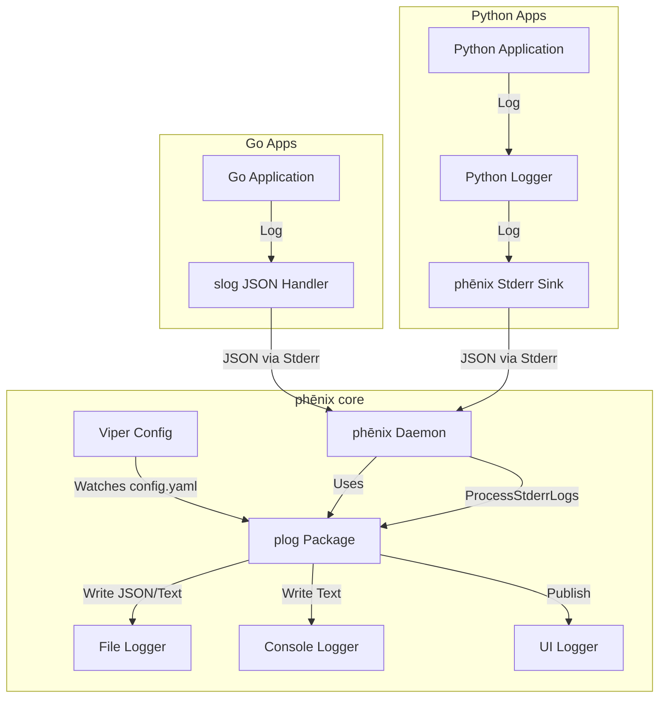

# Logging

phēnix features a centralized logging system that aggregates logs from the core daemon, internal Go services, and external user applications.

## Architecture

The logging architecture is designed to be **centralized**. The phēnix core acts as the aggregator, capturing `stderr` from all running applications, parsing the output as JSON, and ingesting it into the centralized logging system.



## The App Contract

All applications (Go or Python) running under phēnix must adhere to the following contract to ensure their logs are correctly parsed and displayed in the UI:

1.  **Output**: Logs must be written to `stderr`.
2.  **Format**: Logs must be single-line **JSON** objects.
3.  **Required Fields**:
    *   `level`: `DEBUG`, `INFO`, `WARN`, `ERROR`
    *   `msg`: The log message string.
    *   `time`: Timestamp (RFC3339 or similar).
4.  **Optional Fields**:
    *   `traceback`: For exceptions/panics (string).

!!! tip
    Check out the [Example Applications](examples.md#example-applications) for complete, runnable reference implementations in Go and Python.

### Python Apps
Use the `phenix_apps.common.logger`. It is pre-configured to output JSON to stderr.

!!! important
    For fatal errors, **raise an exception** (e.g., `ValueError`, `RuntimeError`) instead of calling `sys.exit(1)`. The `AppBase` class wraps execution in a try/except block and will automatically catch the exception, log the traceback as structured JSON, and exit cleanly.

```python
from phenix_apps.common.logger import logger

def my_func():
    try:
        logger.bind(custom_field="value").info("Starting operation")
        # ... code ...
    except Exception:
        # Automatically captures traceback and formats as JSON
        logger.exception("Operation failed")
```

### Go Apps
Use `log/slog` with a JSON handler.

```go
import (
    "log/slog"
    "os"
)

func main() {
    logger := slog.New(slog.NewJSONHandler(os.Stderr, nil))
    slog.SetDefault(logger)

    slog.Info("Application started", "app", "my-app")
}
```

### phēnix Core
Use the `phenix/util/plog` package for logging within the core application.

```go
import "phenix/util/plog"

func MyFunc() {
    // Always provide a LogType enum for UI filtering
    plog.Info(plog.TypeSystem, "System initialized", "version", "1.0")
}
```

### HTTP Request Logging
To view detailed HTTP request logs (method, path, status, duration), start the UI with the `--log-requests` flag.

!!! tip "Troubleshooting"
    For common logging issues and solutions, please see the [Troubleshooting](troubleshooting.md) page.
